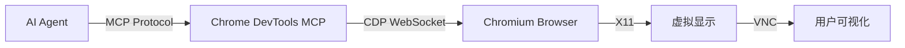

# 从零开始构建 Manus 系统：02-Sandbox Chrome

## 📍 导航指南

在构建了基础的 VNC 可视化沙盒后，下一步是赋予 AI Agent "看"互联网的能力。

- 🌐 **为什么需要浏览器？** → [第一部分：背景与架构](#part-1) - 理解 AI 访问 Web 的必要性
- 🛠️ **如何安装？** → [第二部分：环境构建](#part-2) - Chromium 与 Node.js 环境配置
- ⚙️ **怎么配置？** → [第三部分：服务编排](#part-3) - Supervisor 与启动脚本详解
- 🔌 **如何连接？** → [第四部分：MCP集成](#part-4) - Chrome DevTools MCP 的工作原理

---

## 目录

### 第一部分：背景与架构 🌐
- [为什么要给沙盒装浏览器？](#why-browser)
- [架构设计：CDP 与 MCP](#architecture)

### 第二部分：环境构建 🛠️
- [Chromium 安装指南](#chromium-install)
  - [PPA 源配置](#ppa-setup)
  - [中文字体支持](#fonts)
- [Node.js 与 MCP 工具链](#nodejs-mcp)

### 第三部分：服务编排 ⚙️
- [启动脚本：launch_chrome.sh](#launch-script)
  - [关键参数解析](#chrome-flags)
- [Supervisor 配置](#supervisor-config)
  - [进程依赖管理](#process-deps)

### 第四部分：MCP集成 🔌
- [chrome-devtools-mcp 配置](#mcp-config)
- [实际应用场景](#usage-scenarios)

### 附录
- [常见问题 FAQ](#faq)

---

## 引言

在上一篇文章 [Sandbox VNC](./002-sandbox-vnc-overview.md) 中，我们成功构建了一个可视化的 Linux 桌面环境。但这只是第一步。一个强大的 AI Agent 不仅需要控制操作系统，更需要通过浏览器与互联网交互——搜索信息、访问文档、甚至操作 Web 应用。

本文将详细介绍如何在 Docker 沙盒中集成 Chrome 浏览器，并通过 **Chrome DevTools MCP** (Model Context Protocol) 让 AI Agent 能够以标准化的方式控制浏览器。

---

<a id="part-1"></a>
## 第一部分：背景与架构 🌐

<a id="why-browser"></a>
### 为什么要给沙盒装浏览器？

对于人类来说，浏览器是获取信息的主要窗口。对于 AI Agent 而言，集成浏览器能力意味着：

1.  **实时信息获取**：不再局限于训练数据，可以访问最新的网页内容。
2.  **Web 应用操作**：可以登录网站、填写表单、点击按钮，完成复杂的业务流程。
3.  **调试与开发**：对于辅助编程的 Agent，可以直接在浏览器中预览和调试 Web 项目。

<a id="architecture"></a>
### 架构设计：CDP 与 MCP

我们的实现方案基于以下调用链：



-   **CDP (Chrome DevTools Protocol)**: Chrome 浏览器原生的调试协议，提供了对浏览器的底层控制能力。
-   **MCP (Model Context Protocol)**: Anthropic 推出的标准化协议，将 CDP 的复杂接口封装为 AI 易于理解的工具（如 `navigate`, `click`, `screenshot`）。

---

<a id="part-2"></a>
## 第二部分：环境构建 🛠️

<a id="chromium-install"></a>
### Chromium 安装指南

在 Docker 环境中安装浏览器并不简单，特别是需要支持最新的 Web 标准和扩展时。我们选择安装 Chromium 而非 Google Chrome，以便更好地适配 Linux 环境。

<a id="ppa-setup"></a>
#### PPA 源配置

为了获取较新版本的 Chromium，我们需要配置 PPA 源。这里有一个小技巧，`add-apt-repository` 在某些 Ubuntu 版本下依赖特定的 Python 版本，我们通过临时切换 Python 版本来解决兼容性问题：

```dockerfile
# 安装 Chromium (使用 PPA 源以获取更新版本)
# 注意：需要使用 python3.10 来执行 add-apt-repository，因为 apt_pkg 依赖问题
RUN PYTHON_VERSION=$(python3 --version) && \
    update-alternatives --install /usr/bin/python3 python3 /usr/bin/python3.10 2 && \
    add-apt-repository ppa:xtradeb/apps -y && \
    update-alternatives --install /usr/bin/python3 python3 /usr/bin/python3.11 1 && \
    apt-get update && \
    apt-get install -y chromium --no-install-recommends
```

> **重要提示**：这里通过临时切换 Python 版本来解决 PPA 添加时的兼容性问题。首先切换到 Python 3.10 执行 `add-apt-repository`，然后切回 Python 3.11。

<a id="fonts"></a>
#### 中文字体支持

为了让浏览器正确显示中文网页，必须安装字体包：

```dockerfile
RUN apt-get update && apt-get install -y \
    fonts-noto-cjk \
    fonts-noto-color-emoji \
    language-pack-zh-hans \
    locales \
    && locale-gen zh_CN.UTF-8
```

<a id="nodejs-mcp"></a>
### Node.js 与 MCP 工具链

`chrome-devtools-mcp` 是一个 Node.js 应用，因此我们需要准备 Node 环境：

```dockerfile
# Install Node.js 20.x
RUN mkdir -p /etc/apt/keyrings && \
    curl -fsSL https://deb.nodesource.com/gpgkey/nodesource-repo.gpg.key | gpg --dearmor -o /etc/apt/keyrings/nodesource.gpg && \
    echo "deb [signed-by=/etc/apt/keyrings/nodesource.gpg] https://deb.nodesource.com/node_20.x nodistro main" | tee /etc/apt/sources.list.d/nodesource.list && \
    apt-get update && \
    apt-get install -y nodejs && \
    apt-get clean && \
    rm -rf /var/lib/apt/lists/*

# Configure npm to use Aliyun mirror
RUN npm config set registry https://registry.npmmirror.com

# Install official MCP servers
RUN npm install -g chrome-devtools-mcp@latest && \
    npm install -g @modelcontextprotocol/server-filesystem@latest
```

> **注意**：我们同时安装了 `chrome-devtools-mcp` 和 `@modelcontextprotocol/server-filesystem`，后者是官方的文件系统 MCP 服务器，在 Supervisor 配置中也会用到。

---

<a id="part-3"></a>
## 第三部分：服务编排 ⚙️

<a id="launch-script"></a>
### 启动脚本：launch_chrome.sh

为了确保 Chrome 能够被远程控制，我们需要通过脚本启动它，并注入特定的参数。

创建 `/usr/local/bin/launch_chrome.sh`：

```bash
#!/bin/bash
# 等待 Xvfb 就绪
sleep 2

# 启动 Chrome (前台运行，不要使用 &)
# 添加 --incognito 避免崩溃恢复弹窗
exec /usr/bin/chromium \
  --no-sandbox \
  --remote-debugging-port=9222 \
  --user-data-dir=/tmp/chrome-profile \
  --disable-gpu \
  --disable-software-rasterizer \
  --incognito \
  --no-first-run \
  --test-type \
  --no-default-browser-check

```

<a id="chrome-flags"></a>
#### 关键参数解析

-   `--remote-debugging-port=9222`: **最关键的参数**。它让 Chrome **在容器内部监听** CDP 端口。**注意：MCP Server 并不是浏览器本身，而是一个独立的 Node.js 进程。** 它需要通过这个端口（基于 WebSocket 的 CDP 协议）连接到 Chrome，才能把 AI 的指令传达给浏览器。如果没有这个端口，MCP Server 就无法控制任何东西。
-   `--no-sandbox`: 在 Docker 容器中运行 Chrome 必须的参数（因为 Docker 本身已经是沙盒）。
-   `--disable-gpu`: 在没有 GPU 的容器环境中，禁用 GPU 加速可以提高稳定性。

<a id="supervisor-config"></a>
### Supervisor 配置

我们需要在 `supervisord.conf` 中管理 Chrome 和 MCP Server 两个进程。注意进程的启动优先级设置，确保依赖关系正确。

```ini
; Launch Chrome browser with remote debugging
[program:chrome]
command=/usr/local/bin/launch_chrome.sh
environment=DISPLAY=":1"
autorestart=true
stdout_logfile=/dev/stdout
stdout_logfile_maxbytes=0
stderr_logfile=/dev/stderr
stderr_logfile_maxbytes=0
priority=200
startsecs=10

; MCP Chrome DevTools Server (Official - Node.js)
[program:mcp-chrome]
command=/usr/bin/node /usr/lib/node_modules/chrome-devtools-mcp/build/src/index.js --browserUrl http://127.0.0.1:9222
directory=/root/shared/workspace
environment=DISPLAY=":1",NODE_ENV="production"
autorestart=true
stdout_logfile=/dev/stdout
stdout_logfile_maxbytes=0
stderr_logfile=/dev/stderr
stderr_logfile_maxbytes=0
priority=602
startsecs=5
```

<a id="process-deps"></a>
#### 进程依赖管理

注意 `priority` 的设置（实际的完整启动顺序）：
-   `xvfb` (100) 先启动，提供虚拟显示环境。
-   `fluxbox` (200) 启动窗口管理器。
-   `xterm` (300) 启动终端模拟器。
-   `x11vnc` (400) 启动 VNC 服务器。
-   `websockify` (500) 启动 WebSocket 代理。
-   `mcp-shell` (600) 启动 Shell MCP 服务器。
-   `mcp-filesystem` (601) 启动文件系统 MCP 服务器。
-   `chrome` (200) 启动 Chrome 浏览器。
-   `mcp-chrome` (602) 启动 Chrome DevTools MCP 服务器。
-   `mcp-manager` (603) 启动 Meta-MCP 管理器。

Chrome 设置为 `priority=200` 是为了确保它在窗口管理器之后但在大多数 MCP 服务器之前启动，这样可以保证有合适的显示环境，同时 MCP Chrome 服务器（602）会在 Chrome 之后启动。

---

<a id="part-4"></a>
## 第四部分：MCP集成 🔌

<a id="mcp-config"></a>
### chrome-devtools-mcp 配置

`chrome-devtools-mcp` 是官方提供的 MCP 实现，它充当了适配器的角色。

-   **输入**：标准的 MCP 协议请求（JSON-RPC）。
-   **输出**：CDP 协议指令。

在 Supervisor 配置中，我们指定了 `--browserUrl http://127.0.0.1:9222`，这告诉 MCP Server 去哪里找到正在运行的 Chrome 实例。

<a id="usage-scenarios"></a>
### 实际应用场景

当一切配置就绪，AI Agent 就可以通过 MCP 协议调用以下工具：

1.  **Page Navigation**:
    ```json
    { "name": "navigate", "args": { "url": "https://github.com" } }
    ```
    Agent 发送此指令后，沙盒中的 Chrome 会跳转到 GitHub，用户可以通过 VNC 实时看到页面加载。

2.  **Screenshot**:
    ```json
    { "name": "screenshot", "args": { "path": "github_home.png" } }
    ```
    Agent 可以截取当前页面并保存到工作区，便于后续的视觉分析。

3.  **Interaction**:
    Agent 可以模拟点击 (`click`)、输入 (`type`) 和滚动 (`scroll`)，像真人一样操作网页。

---

## 第五部分：验证与测试 🧪

为了验证我们的 Chrome MCP 是否正常工作，我们可以编写一个简单的 Python 脚本，通过 `docker exec` 连接到容器内的 MCP 服务，并执行实际的浏览器操作。

### 测试脚本：demo_interaction.py

项目提供了完整的 MCP 服务器测试脚本，可以测试所有三个 MCP 服务器（Shell、Filesystem、Chrome）的功能。

```python
import asyncio
import json
import base64
import os
from datetime import datetime
from mcp import ClientSession, StdioServerParameters
from mcp.client.stdio import stdio_client

async def run():
    # 1. 配置连接参数
    # 我们通过 docker exec -i 调用容器内的 MCP Server，并将其 stdin/stdout 映射出来
    server_params = StdioServerParameters(
        command="docker",
        args=[
            "exec", "-i", 
            "sandbox-chrome",  # 确保与 docker-compose.yml 中的 container_name 一致
            "node", "/usr/lib/node_modules/chrome-devtools-mcp/build/src/index.js",
            "--browserUrl", "http://127.0.0.1:9222"
        ],
        env=None
    )

    print("🤖 正在连接到 Chrome MCP 沙盒环境...")
    
    async with stdio_client(server_params) as (read, write):
        async with ClientSession(read, write) as session:
            # 初始化会话
            await session.initialize()
            
            # 获取可用工具列表
            tools = await session.list_tools()
            tool_names = [t.name for t in tools.tools]
            print(f"✅ 连接成功！可用工具: {len(tool_names)} 个")
            print(f"   工具列表: {tool_names}")
            
            # ---------------------------------------------------------
            # 场景：在 Baidu 搜索 "MCP Protocol" 并截图
            # ---------------------------------------------------------
            
            # 1. 导航到 Baidu
            print("\n🌐 1. 正在打开 Baidu (https://www.baidu.com)...")
            # 工具名: navigate_page
            nav_result = await session.call_tool("navigate_page", arguments={"url": "https://www.baidu.com"})
            print(f"   导航结果: {nav_result}")
            
            print("   ⏳ 等待 5 秒让页面加载...")
            await asyncio.sleep(5)
            
            # 截图查看当前状态
            print("📸 1.5 页面加载后截图...")
            # 确保 workspace 目录存在
            os.makedirs("workspace", exist_ok=True)
            
            if "take_screenshot" in tool_names:
                # 必须传入一个对象，即使是空的
                screenshot_result = await session.call_tool("take_screenshot", arguments={})
                
                img_content = None
                for content in screenshot_result.content:
                    if content.type == "image":
                        img_content = content
                        break
                    elif content.type == "text":
                         print(f"   截图文本信息: {content.text[:100]!r}")
                         # 如果包含 data:image，可能是嵌入在 text 中的
                         if "data:image" in content.text:
                             img_content = content
                             break
                
                if img_content:
                    try:
                        data = img_content.data if hasattr(img_content, "data") else img_content.text
                        if "data:image" in data and "base64," in data:
                             data = data.split("base64,")[1]
                        
                        # 补全 padding
                        padding = len(data) % 4
                        if padding > 0:
                             data += "=" * (4 - padding)
                             
                        filepath = "workspace/screenshot_step1.png"
                        with open(filepath, "wb") as f:
                            f.write(base64.b64decode(data))
                        print(f"   ✅ 已保存: {filepath}")
                    except Exception as e:
                        print(f"   ❌ 保存截图失败: {e}")
                else:
                    print("   ⚠️ 未找到图像数据")

            # 2. 获取页面标题 (使用 evaluate_script)
            if "evaluate_script" in tool_names:
                print("📑 2. 获取页面标题...")
                # 参数修正: 传入完整的函数定义
                result = await session.call_tool("evaluate_script", arguments={
                    "function": "function() { return document.title; }"
                })
                print(f"   页面标题: {result.content}")

            # 3. 模拟搜索输入 (使用 fill 和 click 工具)
            print("⌨️  3. 输入搜索词 'MCP Protocol'...")
            
            if "fill" in tool_names:
                print("   正在输入关键词...")
                await session.call_tool("fill", arguments={
                    "selector": "#kw",
                    "value": "MCP Protocol"
                })
            
            if "click" in tool_names:
                print("   正在点击搜索按钮...")
                await session.call_tool("click", arguments={
                    "selector": "#su"
                })
            
            print("   ⏳ 等待 5 秒让搜索结果加载...")
            await asyncio.sleep(5)

            # 4. 最终截图
            print("📸 4. 正在最终截图...")
            if "take_screenshot" in tool_names:
                try:
                    screenshot_result = await session.call_tool("take_screenshot", arguments={})
                    
                    img_content = None
                    for content in screenshot_result.content:
                        if content.type == "image":
                            img_content = content
                            break
                        elif content.type == "text":
                            if "data:image" in content.text:
                                img_content = content
                                break
                    
                    if img_content:
                        data = img_content.data if hasattr(img_content, "data") else img_content.text
                        if "data:image" in data and "base64," in data:
                             data = data.split("base64,")[1]
                        
                        padding = len(data) % 4
                        if padding > 0:
                             data += "=" * (4 - padding)
                             
                        filepath = "workspace/screenshot_final.png"
                        with open(filepath, "wb") as f:
                            f.write(base64.b64decode(data))
                        print(f"   ✅ 已保存: {filepath}")
                    else:
                        print("   ⚠️ 未找到图像数据")
                except Exception as e:
                    print(f"   ❌ 截图失败: {e}")

if __name__ == "__main__":
    asyncio.run(run())

```

### 运行测试

在宿主机上运行此脚本：

```bash
# 确保沙盒正在运行
cd sandbox && docker-compose ps

# 运行完整测试（测试所有 MCP 服务器）
python3 test_mcp_simple.py

# 或者只测试 Chrome MCP
python3 -c "
import subprocess, json, time

cmd = ['docker', 'exec', '-i', '-e', 'DISPLAY=:1', '-e', 'NODE_ENV=production', 'sandbox-sandbox-os-1', '/usr/bin/node', '/usr/lib/node_modules/chrome-devtools-mcp/build/src/index.js']

proc = subprocess.Popen(cmd, stdin=subprocess.PIPE, stdout=subprocess.PIPE, stderr=subprocess.PIPE, text=True)
time.sleep(0.5)

init = {'jsonrpc': '2.0', 'id': 1, 'method': 'initialize', 'params': {'protocolVersion': '2024-11-05', 'capabilities': {}, 'clientInfo': {'name': 'test-client', 'version': '1.0.0'}}}
proc.stdin.write(json.dumps(init) + '\n')
proc.stdin.flush()

for _ in range(10):
    line = proc.stdout.readline()
    if not line: break
    try:
        data = json.loads(line)
        if 'result' in data:
            print('✅ Chrome MCP connected successfully!')
            break
    except: continue
else:
    print('❌ Chrome MCP failed to connect')

proc.terminate()
"
```

与此同时，打开 VNC (http://localhost:6080)，你应该能看到 Chrome 浏览器正在运行。

---

<a id="faq"></a>
## 常见问题 FAQ

**Q: 我通过 MCP 操作浏览器，为什么还需要开启 CDP 端口？**
A: 这是一个经典的“翻译官”模型。AI 只懂 MCP 协议，Chrome 只懂 CDP 协议。`chrome-devtools-mcp` 就是中间的翻译官。翻译官必须手里拿着“电话线”（CDP 端口）才能跟 Chrome 通话。如果没有开启这个端口，MCP Server 即使收到了 AI 的指令，也无法传递给浏览器执行。

**Q: 为什么 Dockerfile 里没有 EXPOSE 9222 端口？**
A: 因为 MCP Server 和 Chrome 运行在同一个容器内，它们通过容器内部的 `localhost:9222` 通信。
为了安全起见，我们不需要（也不应该）把这个调试端口暴露给宿主机或公网。只有 MCP Server 有权访问这个端口，这就形成了一个安全的边界：外部只能通过受控的 MCP 协议与浏览器交互。

**Q: 为什么不用无头模式 (Headless)？**
A: 虽然无头模式资源占用更少，但为了让用户能通过 VNC "监工" AI 的操作，我们需要有头模式 (Headed) 配合 Xvfb。这样既能被程序控制，又能被人类看见。

**Q: 浏览器崩溃了怎么办？**
A: Supervisor 配置了 `autorestart=true`，如果 Chrome 进程意外退出，它会被自动拉起。`launch_chrome.sh` 中的 `user-data-dir` 使用临时目录，避免了崩溃后 Profile 锁定导致无法启动的问题。

**Q: 如何处理验证码？**
A: 这是一个复杂问题。目前的沙盒环境允许用户通过 VNC 介入。如果 AI 遇到验证码，可以暂停并通知用户，用户通过 VNC 手动解决后，AI 继续执行。

---

## 📝 结语

通过集成 Chrome 和 MCP，我们的沙盒环境进化成了一个全能的数字工作台。现在，AI 不仅能写代码、跑命令，还能像我们一样自由地探索万维网。

在下一篇文章中，我们将探讨 **文件系统 MCP** 的实现，看看 AI 是如何在这个沙盒中高效地管理项目文件的。
