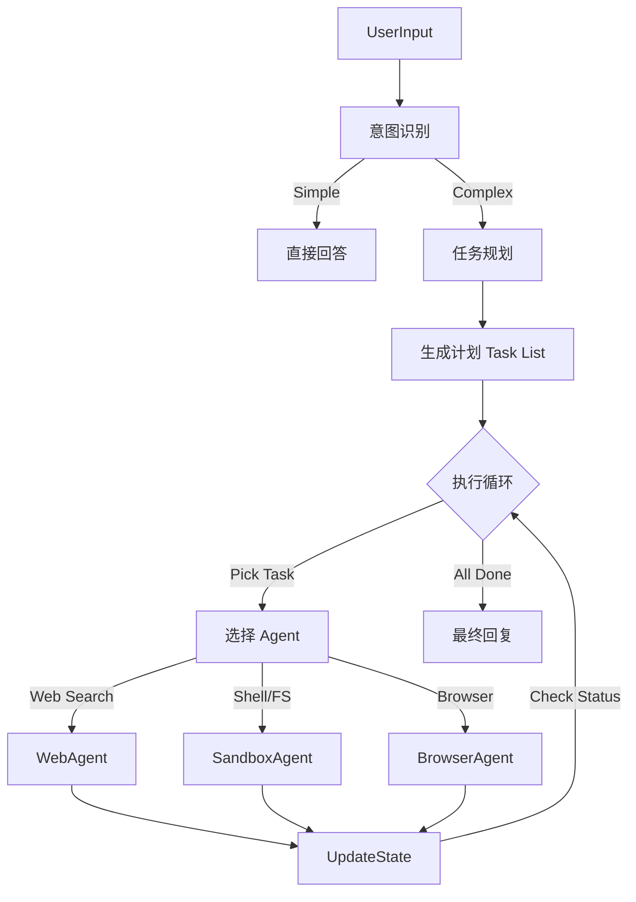

# 从零开始构建 Manus 系统：06-Sandbox Agent Core

## 📍 导航指南

在完成了[Chrome](./003-sandbox-chrome-mcp.md)、[Filesystem](./004-sandbox-filesystem-mcp.md)和[Shell](./005-sandbox-shell-mcp.md)的 MCP Server 建设后，我们实际上是为 Agent 打造了"眼"、"手"和"脚"。但如果没有一个聪明的"大脑"来指挥，这些肢体就只是一堆散落的工具。

本篇博客将带你构建 Manus 的核心——**Agent Brain**。

- 🧠 **大脑如何工作？** → [第一部分：认知架构](#part-1) - 理解 Agent 的思考模式
- 🔌 **连接肢体** → [第二部分：神经系统](#part-2) - MCP Client Manager 的集成
- 📝 **规划与决策** → [第三部分：意图与规划](#part-3) - Intent Analysis 与 Planning
- 🔄 **执行循环** → [第四部分：LangGraph 工作流](#part-4) - 构建状态机
- 🧪 **实战演示** → [第五部分：综合测试](#part-5) - 完整的任务执行

---

## 目录

### 第一部分：认知架构 🧠
- [ReAct vs Plan-and-Execute](#cognitive-model)
- [Agent 状态定义](#agent-state)

### 第二部分：神经系统 🔌
- [MCP Client Manager](#mcp-manager)
- [工具链的统一](#tool-unification)

### 第三部分：意图与规划 📝
- [意图识别 (Intent Analysis)](#intent-analysis)
- [任务分解 (Planning)](#planning)

### 第四部分：LangGraph 工作流 🔄
- [状态机设计](#state-graph)
- [节点实现](#node-implementation)

### 第五部分：实战演示 🧪
- [案例：哈尔滨旅游攻略](#demo-case)
- [执行日志分析](#log-analysis)

### 附录
- [常见问题 FAQ](#agent-faq)

---

## 引言

如果说 MCP Server 是 Agent 的"躯体"，那么 `agent.py` 就是 Agent 的"灵魂"。在这里，我们不再关注如何执行一个具体的 `ls` 命令，而是关注**为什么要执行它**，以及**执行完之后下一步做什么**。

在 `006demo` 中，我们采用了 **LangGraph** 来构建 Agent 的认知循环，它比传统的线性 Chain 更加灵活，能够处理循环、分支和自我修正。

---

<a id="part-1"></a>
## 第一部分：认知架构 🧠

<a id="cognitive-model"></a>
### ReAct vs Plan-and-Execute

对于简单的任务（如"查询天气"），传统的 ReAct (Reason + Act) 模式就足够了。但对于复杂任务（如"制定一个包含搜索、整理文件、运行代码的旅游攻略"），我们需要更高级的 **Plan-and-Execute** 模式。

我们的架构设计如下：



<a id="agent-state"></a>
### Agent 状态定义

在 LangGraph 中，状态（State）是核心。我们在 `agent.py` 中定义了 `AgentState`，它不仅包含对话历史，还包含当前的计划和任务进度：

```python
class AgentState(TypedDict):
    messages: Annotated[List[BaseMessage], add_messages]  # 对话历史
    user_input: str                                       # 原始用户输入
    intent: Optional[IntentAnalysis]                      # 意图分析结果
    plan: Optional[Plan]                                  # 当前的任务计划
    current_task_index: int                               # 当前正在执行的任务索引
    scratchpad: Dict[str, Any]                            # 中间结果暂存区
```

---

<a id="part-2"></a>
## 第二部分：神经系统 🔌

在让大脑思考之前，我们需要先确保它能控制肢体。这就用到了我们上一节提到的 `MCPClientManager`。

<a id="mcp-manager"></a>
### MCP Client Manager

`MCPClientManager` 充当了"神经系统"的角色。它在 `agent.py` 初始化时被调用，负责建立与 Docker 容器内各个 MCP Server 的连接。

```python
# agent.py
async def main():
    # 1. 启动神经系统
    mcp_manager = MCPClientManager()
    await mcp_manager.connect()

    # 2. 获取肢体能力 (Tools)
    tools = []
    tools.extend(await mcp_manager.get_tools("shell"))
    tools.extend(await mcp_manager.get_tools("filesystem"))
    tools.extend(await mcp_manager.get_tools("chrome"))
    
    # 3. 添加大脑内置能力 (Web Search)
    tools.append(web_search)
```

<a id="tool-unification"></a>
### 工具链的统一

通过 Manager，我们将不同来源的工具统一为 LangChain 可识别的 `StructuredTool`。这意味着 Agent 不需要知道 `run_command` 是来自 Docker 里的 Shell Server，还是本地的 Python 函数，它只需要根据工具描述（Description）来决定调用哪个。

---

<a id="part-3"></a>
## 第三部分：意图与规划 📝

<a id="intent-analysis"></a>
### 意图识别 (Intent Analysis)

Agent 的第一步是理解用户想要什么。我们定义了一个 Pydantic 模型 `IntentAnalysis`：

```python
class IntentAnalysis(BaseModel):
    intent: str = Field(description="用户意图的简明描述")
    needs_sandbox: bool = Field(description="是否需要沙盒操作")
    confidence: float = Field(description="置信度")
```

通过 LLM 结构化输出，我们可以快速判断这是个简单对话（如"你好"）还是个复杂任务（如"帮我写代码"）。

<a id="planning"></a>
### 任务分解 (Planning)

如果需要执行任务，Planner 节点会介入。它会将用户的模糊目标转化为具体的步骤列表 `Plan`：

```python
class Task(BaseModel):
    id: int
    description: str
    assigned_agent: AgentType  # 分配给最合适的专家 (Shell, Browser, etc.)
    status: TaskStatus

class Plan(BaseModel):
    goal: str
    tasks: List[Task]
```

例如，对于"查一下哈尔滨天气并写到文件里"，Planner 可能会生成：
1.  **Task 1 (Web Search)**: 搜索"哈尔滨未来7天天气"。
2.  **Task 2 (Filesystem)**: 将搜索结果整理并写入 `harbin_weather.txt`。

---

<a id="part-4"></a>
## 第四部分：LangGraph 工作流 🔄

<a id="state-graph"></a>
### 状态机设计

这是 Agent 的核心循环逻辑。我们使用 `StateGraph` 来编排节点：

```python
workflow = StateGraph(AgentState)

# 定义节点
workflow.add_node("analyze_intent", analyze_intent)
workflow.add_node("create_plan", create_plan)
workflow.add_node("execute_task", execute_task)
workflow.add_node("evaluate_progress", evaluate_progress)

# 定义边 (Edge)
workflow.add_edge(START, "analyze_intent")

# 条件分支：根据意图决定是直接规划还是结束
workflow.add_conditional_edges(
    "analyze_intent",
    should_plan,
    {
        "plan": "create_plan",
        "end": END
    }
)

workflow.add_edge("create_plan", "execute_task")
workflow.add_edge("execute_task", "evaluate_progress")

# 循环：如果在评估中发现任务未完成，回到执行节点
workflow.add_conditional_edges(
    "evaluate_progress",
    check_completion,
    {
        "continue": "execute_task",
        "end": END
    }
)
```

<a id="node-implementation"></a>
### 节点实现

-   **execute_task**: 获取 `current_task_index` 指向的任务，根据 `assigned_agent` 类型，调用绑定了特定工具的 LLM 来执行。
-   **evaluate_progress**: 检查上一步的执行结果，更新 `Task.status`（标记为 Completed 或 Failed），并决定是否移动到下一个任务。

---

<a id="part-5"></a>
## 第五部分：实战演示 🧪

<a id="demo-case"></a>
### 案例：哈尔滨旅游攻略

我们运行 `test_agent_simple.py`，输入："帮我做一份哈尔滨6日游攻略，保存到文件。"

**执行流程日志**：

1.  **🧠 Intent Analysis**: 识别为需要沙盒操作，意图为"制定哈尔滨6日游攻略并保存"。
2.  **📋 Planning**:
    -   Task 1 (Web Search): 搜索哈尔滨必游景点和美食。
    -   Task 2 (Web Search): 规划6天行程路线。
    -   Task 3 (Filesystem): 创建 `harbin_itinerary.txt` 并写入内容。
3.  **🔄 Execution Loop**:
    -   **Executing Task 1**: 调用 `web_search` 工具，获取冰雪大世界、中央大街等信息。
    -   **Executing Task 2**: 调用 `web_search` 工具，获取路线建议。
    -   **Executing Task 3**: 调用 `write_file` 工具，将整理好的 Markdown 内容写入沙盒中的 `/root/shared/workspace/harbin_itinerary.txt`。
4.  **✅ Completion**: 输出"攻略已生成，文件位于..."。

<a id="log-analysis"></a>
### 观察 Agent 的"思考"

在 `execute_task` 中，我们可以看到 LLM 的 ReAct 思考过程：

```text
Thought: 我需要先搜索哈尔滨的热门景点。
Action: web_search(query="哈尔滨热门景点")
Observation: ...返回了冰雪大世界、索菲亚教堂...
Thought: 信息足够了，现在我需要规划路线。
...
```

这就是 Agent Brain 的魅力所在：它不仅是在执行命令，而是在根据环境反馈动态调整策略。

---

## 📝 结语

通过 `006demo`，我们成功地给"四肢发达"的沙盒环境装上了一个"头脑清晰"的大脑。
- **MCP Client Manager** 提供了统一的神经信号传输。
- **LangGraph** 提供了结构化的认知思维模型。
- **Planning** 模块让 Agent 能够处理长时程、多步骤的复杂任务。

至此，Manus 系统已经初具雏形，具备了全栈工程师的基本素质：能上网查资料，能写代码，能跑命令，还能自我规划。

在接下来的文章中，我们将进一步探索如何优化 Agent 的记忆机制（Memory）和反思能力（Reflection），让它变得更加智能。

---

## 📚 技术参考

- [LangGraph Documentation](https://langchain-ai.github.io/langgraph/)
- [LangChain Agents](https://python.langchain.com/docs/modules/agents/)
- [DeepSeek API](https://www.deepseek.com/)

---

**实现时间**: 2026-01-24
**核心组件**: LangGraph, MCPClientManager, OpenAI/DeepSeek
**认知模式**: Plan-and-Execute
