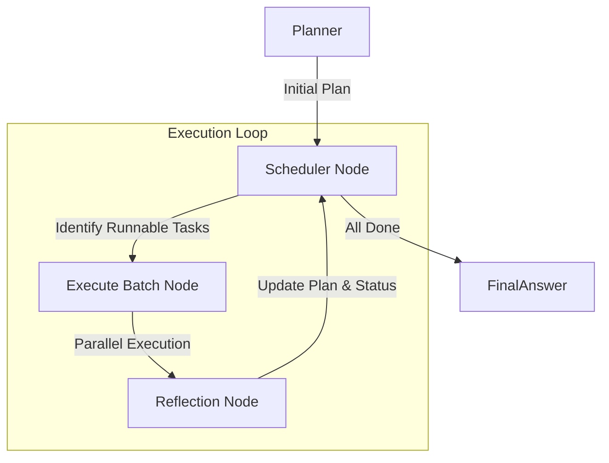

# 从零开始构建 Manus 系统：07-Sandbox Agent Evolution

## 📍 导航指南

在[006-Sandbox Agent Core](./006-sandbox-agent-core.md)中，我们为 Agent 构建了基于 LangGraph 的"大脑"，使其具备了 Planning 和 ReAct 的能力。然而，006 版本的 Agent 仍然是一个"单线程"的工作者——它一次只能做一件事，而且所有的能力都集中在一个通用的 Agent 上。

本篇博客将带你进入 `007demo`，我们将对 Agent 进行一次彻底的**进化**。

- ⚡️ **并行加速** → [第一部分：并行调度架构](#part-1) - 从串行到并行的飞跃
- 🏭 **专业分工** → [第二部分：Agent 工厂模式](#part-2) - 术业有专攻
- 📢 **协同通讯** → [第三部分：共享黑板机制](#part-3) - 多 Agent 间的数据同步
- 🚀 **服务化** → [第四部分：FastAPI 集成](#part-4) - 从脚本到服务
- 🧪 **实战演示** → [第五部分：综合测试](#part-5) - 并行任务执行展示

---

## 目录

### 第一部分：并行调度架构 ⚡️
- [Scheduler-Batch-Reflection 循环](#scheduler-loop)
- [AsyncIO 并行执行](#asyncio-exec)

### 第二部分：Agent 工厂模式 🏭
- [Specialized Sub-Agents](#specialized-agents)
- [Agent Factory 实现](#agent-factory)

### 第三部分：协同通讯 📢
- [三层记忆架构](#memory-architecture)
- [Shared Blackboard](#shared-blackboard)

### 第四部分：服务化 🚀
- [FastAPI Service](#fastapi-service)
- [Session Management](#session-management)

### 第五部分：实战演示 🧪
- [案例：多线任务并行处理](#demo-case)

---

## 引言

在现实世界中，当我们面对一个复杂项目时，通常不会一个人从头干到尾，而是会分工协作：前端开发界面，后端开发接口，测试编写用例——这三者往往是并行进行的。

006 版本的 Agent 就像一个全能但效率低下的"独行侠"。为了解决这个问题，我们在 007 版本中引入了 **并行执行（Parallel Execution）** 和 **专业分工（Specialization）**。

---

<a id="part-1"></a>
## 第一部分：并行调度架构 ⚡️

<a id="scheduler-loop"></a>
### Scheduler-Batch-Reflection 循环

传统的 ReAct 循环是 `Thought -> Action -> Observation` 的线性过程。在 007 中，我们将工作流重构为更适合并行的模式：



1.  **Scheduler Node**: 扫描任务列表，找出所有 `PENDING` 且**依赖项已满足**的任务。
2.  **Execute Batch Node**: 同时启动所有可运行的任务。
3.  **Reflection Node**: 收集所有任务的执行结果，评估进度，并决定是否需要修改后续计划。

<a id="asyncio-exec"></a>
### AsyncIO 并行执行

在 `execute_batch_node` 中，我们利用 Python 的 `asyncio.gather` 来实现真正的 I/O 并行：

```python
# app/core/execution.py

async def execute_batch_node(state: AgentState, tools_map: Dict) -> Dict:
    # ... 获取待执行任务 ...
    
    coroutines = []
    for task in tasks_to_run:
        # 获取对应的 Agent 实例
        agent = get_agent_for_task(task, blackboard, tools, session_id)
        # 将 run() 方法加入协程列表
        coroutines.append(agent.run())

    # 🚀 并行起飞！
    results = await asyncio.gather(*coroutines)
    
    # ... 处理结果 ...
```

这意味着如果任务 1 是"搜索天气"（耗时 2s），任务 2 是"读取文件"（耗时 0.5s），它们可以同时进行，总耗时仅取决于最慢的任务（约 2s），而不是两者之和（2.5s）。

---

<a id="part-2"></a>
## 第二部分：Agent 工厂模式 🏭

<a id="specialized-agents"></a>
### Specialized Sub-Agents

在 006 中，我们把所有工具（Shell, File, Browser, Search）都塞给了一个 LLM。这会导致 Context Window 被大量工具描述占据，且容易让 LLM 产生幻觉（例如用 Browser 工具去读本地文件）。

在 007 中，我们将 Agent 拆分为多个专家：

-   **ShellAgent**: 专注于命令行操作，精通 `ls`, `grep`, `apt-get` 等。
-   **FilesystemAgent**: 专注于文件读写，擅长 `read_file`, `write_file`, `replace_in_file`。
-   **BrowserAgent**: 专注于网页浏览，擅长 `navigate`, `click`, `extract_text`。
-   **WebSearchAgent**: 专注于信息检索。

<a id="agent-factory"></a>
### Agent Factory 实现

我们使用工厂模式来动态创建 Agent：

```python
# app/core/agents/factory.py

def get_agent_for_task(task: Task, blackboard: SharedBlackboard, tools: List, session_id: str):
    if task.assigned_agent == AgentType.SHELL:
        return ShellAgent(task, blackboard, tools, session_id)
    elif task.assigned_agent == AgentType.BROWSER:
        return BrowserAgent(task, blackboard, tools, session_id)
    # ... 其他类型
    else:
        return GeneralAgent(task, blackboard, tools, session_id)
```

每个 Sub-Agent 都有自己独立的 System Prompt，不仅减少了 Token 消耗，还提高了指令遵循的准确性。

---

<a id="part-3"></a>
## 第三部分：协同通讯 📢

当多个 Agent 并行工作时，它们如何交换信息？例如，SearchAgent 查到的 URL，BrowserAgent 怎么知道要去访问？

<a id="memory-architecture"></a>
### 三层记忆架构

我们设计了三层记忆结构：

1.  **Level A: Main Memory (Global)**
    -   存储最终目标、用户偏好、项目级里程碑。
    -   所有 Agent 只读，只有主流程可以更新。

2.  **Level B: Task Memory (Local)**
    -   每个 Sub-Agent 内部的短暂记忆（Thought/Action/Observation）。
    -   任务结束后即销毁，只保留最终 Summary。

3.  **Level C: Shared Blackboard (Collaboration)**
    -   **这是协同的关键**。它是一个共享的键值对存储。

<a id="shared-blackboard"></a>
### Shared Blackboard

```python
# app/models/schemas.py

class SharedBlackboard(BaseModel):
    variables: Dict[str, Any] = Field(default_factory=dict)
    key_conclusions: List[str] = Field(default_factory=list)
```

当 `WebSearchAgent` 找到一个重要链接时，它不仅会返回结果，还会将其写入黑板：

```python
# WebSearchAgent 内部
self.blackboard.variables["target_url"] = "https://example.com/guide"
```

随后的 `BrowserAgent` 启动时，可以从黑板读取：

```python
# BrowserAgent 内部
url = self.blackboard.variables.get("target_url")
```

---

<a id="part-4"></a>
## 第四部分：服务化 🚀

为了让 Agent 更容易被集成，我们将 `007demo` 封装为一个标准的 FastAPI 服务。

<a id="fastapi-service"></a>
### FastAPI Service

```python
# main.py
app = FastAPI(title="Manus Agent 007 Service")

@app.on_event("startup")
async def startup_event():
    service = get_service()
    await service.initialize() # 初始化 MCP 连接等
```

<a id="session-management"></a>
### Session Management

为了支持多轮对话，我们引入了 `session_id`。所有的执行日志、对话历史都按 Session 隔离存储在 `workspace/sessions/{session_id}` 目录下。这使得 Agent 具备了"状态持久化"的能力，用户可以随时回来继续之前的任务。

---

<a id="part-5"></a>
## 第五部分：实战演示 🧪

<a id="demo-case"></a>
### 案例：多线任务并行处理

假设用户指令："同时帮我查一下 Python 3.12 的新特性，并检查一下本地项目的 requirements.txt 版本。"

**006 (串行) 执行流**:
1. Search Python 3.12 (等待 3s)
2. Read requirements.txt (等待 0.5s)
3. 汇总回答
**总耗时**: ~3.5s

**007 (并行) 执行流**:
1. **Planner**: 生成两个无依赖的任务 Task A 和 Task B。
2. **Scheduler**: 发现 A 和 B 都可以运行。
3. **Executor**: 
    - 线程 1: 启动 `WebSearchAgent` 执行 Task A。
    - 线程 2: 启动 `FilesystemAgent` 执行 Task B。
4. **Completion**: 几乎同时完成。
**总耗时**: ~3s (取决于最慢的那个)

在 `007demo` 的控制台日志中，你会看到类似这样的输出：

```text
🗓️ [Scheduler] Checking for executable tasks...
  🚀 Launching 2 tasks in parallel: [1, 2]

[Agent-web_search] Starting task 1...
[Agent-filesystem] Starting task 2...
...
```

这就是并行架构带来的效率提升。

---

## 📝 结语

`007demo` 标志着我们的 Agent 系统从"单体应用"走向了"微服务架构"（虽然是在进程内模拟）。

- **AsyncIO** 让等待不再是浪费。
- **Specialization** 让每个 Agent 更专注、更专业。
- **Blackboard** 让协作变得井然有序。

现在，我们的 Agent 不仅有一个聪明的大脑，还拥有了三头六臂，可以同时处理多个复杂的子任务。在下一阶段，我们将继续探索更高级的主题，如 **Human-in-the-loop**（人类介入）和 **Self-Evolution**（自我进化）。

---

## 📚 技术参考

- [AsyncIO Documentation](https://docs.python.org/3/library/asyncio.html)
- [FastAPI](https://fastapi.tiangolo.com/)
- [LangChain Architecture](https://python.langchain.com/docs/get_started/introduction)

---

**实现时间**: 2026-01-25
**核心特性**: Parallel Scheduler, Sub-Agents, Shared Blackboard
**架构模式**: Async Event Loop, Factory Pattern
